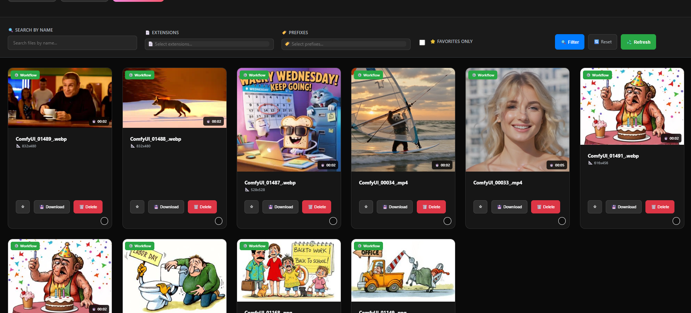
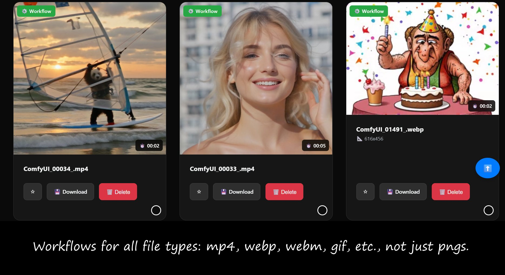

# SmartGallery for ComfyUI: Your Visual Hub with Universal Workflow Recall

**If you find this project useful, please consider giving it a ⭐ star on GitHub! It helps a lot!**

<p align="center">
  
</p>

<p align="center">
  <em>✨ Beautiful, fast, and organized gallery with automatic workflow capture for every generation</em>
</p>

<p align="center">
  <a href="LICENSE"></a>
  <a></a>
  <a href="https://github.com/biagiomaf/smart-comfyui-gallery/stargazers"></a>
</p>

Tired of losing the magic recipe behind your amazing AI creations? Have you ever generated the perfect video or a stunning JPG in ComfyUI, only to realize you can't retrieve the workflow that made it?

**Your creative process is about to get a major upgrade.**

SmartGallery is a complete system designed to revolutionize how you manage your ComfyUI outputs. It not only provides a beautiful, fast, and organized gallery for all your generated media but, for the first time, **automatically saves and links the workflow for *every single file* you generate**—be it a PNG, JPG, MP4, or WebP.

## 🎯 See SmartGallery in Action

<p align="center">
  
</p>

<p align="center">
  <em>🔍 Advanced filtering, organization tools, and instant workflow access</em>
</p>

### The SmartGallery Advantage

* **Universal Workflow Capture:** While ComfyUI's default save nodes only embed workflows in PNG files, and advanced custom save nodes require manual integration into each workflow, the `auto_log_workflows.py` custom node works seamlessly in the background. It automatically saves the complete workflow for every single job you run in ComfyUI, regardless of output format or which save nodes you use.
* **Standalone Operation:** SmartGallery runs on its own port, meaning **you can manage your entire gallery even when ComfyUI is not running**. Organize your creations, move files between folders, delete unwanted outputs, and download workflows anytime.
* **Blazing-Fast Interface:** Using an SQLite database and thumbnail caching, the gallery loads instantly, even with thousands of files.
* **Full Organizational Control:** Create, rename, and delete folders, mark your favorite images, and use powerful search and filters to find exactly what you need.

### ✨ The Two-Part System

SmartGallery works its magic through two key components:

1. **The Logger (`auto_log_workflows.py`):** This lightweight custom node hooks into the ComfyUI backend. It automatically saves a complete JSON workflow for every job, intelligently naming it to match the corresponding output file.
2. **The Gallery Application (`smartgallery.py`):** A modern web interface that serves as your central hub. It reads your output folders and the workflow logs, linking them together and giving you a powerful set of tools to manage your entire collection.

---

### ⚙️ Installation & Setup Guide

Setting up SmartGallery is a two-step process: installing the custom node in ComfyUI and running the gallery application.

#### Step 1: Install the Background Logger in ComfyUI

**Note:** This is not a traditional custom node that appears in the UI. Instead, `auto_log_workflows.py` is a **background execution hook** that runs silently behind the scenes to capture workflows automatically.

1. From this repository, locate the `custom_nodes/auto_log_workflows.py` file in the project structure.
2. Copy this single file directly to your ComfyUI `custom_nodes` directory:
   ```
   Your_ComfyUI_Folder/custom_nodes/auto_log_workflows.py
   ```
   **Important:** Unlike typical custom nodes that require their own folders, this file should be placed directly in the `custom_nodes` directory as a standalone Python file.

3. Restart ComfyUI. The background logger will now be active and will automatically save workflows to `Your_ComfyUI_Folder/input/workflow_logs_success/` for every job execution.

> **💡 Technical Note:** This approach uses ComfyUI's execution hook system to intercept and log workflow data transparently. You won't see this as a node in your workflow - it works completely in the background, capturing the workflow JSON for every execution regardless of which save nodes you use.

> **⭐ Important Note on Existing Files:** The workflow logging will only apply to images and videos generated **after** you have installed the `auto_log_workflows.py` node.
>
> * For previously generated files (JPGs, WebPs, etc.), the gallery will display them, but no workflow will be available for download.
> * For existing PNG files that already contain embedded workflow data, the gallery will be able to extract and provide it.

#### Step 2: Set Up and Run the Gallery Application

This guide assumes you have downloaded the SmartGallery project. The project has the following file structure:

```
smart-comfyui-gallery/
├── smartgallery.py
├── requirements.txt
├── README.md
├── custom_nodes/
│   └── auto_log_workflows.py
├── assets/
│   ├── smartgallery.png
│   └── smartgallery-3.jpg
├── templates/
│   └── index.html
└── static/
    └── galleryout/
        └── favicon.ico
```

**1. Configure Your Paths (Mandatory Step)**

This is the most important step to make the gallery work with your ComfyUI setup.

* Open the `smartgallery.py` file with a text editor.
* Locate the `--- USER CONFIGURATION ---` section at the top of the file.
* You must change `BASE_OUTPUT_PATH` and `BASE_INPUT_PATH` to match your system's paths. You can also customize other settings here.

Here are the key variables you need to check:

```python
# --- USER CONFIGURATION ---
# Modify the parameters in this section to adapt the gallery to your needs.

# Path to the ComfyUI 'output' folder.
# MUST be an absolute path. Example: 'C:/ComfyUI/output'
BASE_OUTPUT_PATH = 'C:/path/to/your/ComfyUI/output'  # <-- CHANGE THIS

# Path to the ComfyUI 'input' folder.
# MUST be an absolute path. Example: 'C:/ComfyUI/input'
BASE_INPUT_PATH = 'C:/path/to/your/ComfyUI/input'   # <-- CHANGE THIS

# Port on which the gallery web server will run.
# Make sure this is NOT the same as your ComfyUI port (usually 8188).
SERVER_PORT = 8189
```

**2. Create a Virtual Environment (Recommended)**

* Open your terminal or command prompt and navigate to the `smart-comfyui-gallery` project folder.
* Create a virtual environment:
  ```bash
  python -m venv venv
  ```
* Activate the environment:
  * **On Windows:** `venv\Scripts\activate`
  * **On macOS/Linux:** `source venv/bin/activate`

**3. Install Dependencies**

* With your virtual environment active, install the required Python libraries:
  ```bash
  pip install -r requirements.txt
  ```

**4. Run the Gallery**

* In the same terminal, run the application:
  ```bash
  python smartgallery.py
  ```
* Open your web browser and go to: **`http://127.0.0.1:8189` or `http://127.0.0.1:8189/galleryout`**

> **⭐ Important First Run Note:** The very first time you run `smartgallery.py`, it may take a few minutes to become accessible. **This is normal!** The application is performing a one-time scan to build the SQLite database and generate thumbnails for all your existing files. Please be patient.
>
> After this initial setup, subsequent launches of the gallery will be much faster.

#### 🔄 Reverse Proxy Configuration

If you want to serve SmartGallery behind a reverse proxy (like Nginx or Apache), make sure to configure your proxy to point to the correct URL endpoint:

```
http://127.0.0.1:8189/galleryout
```

This ensures that all static assets and routing work correctly when accessed through your reverse proxy setup.

---

### 🤝 Contributing & Reporting Issues

Contributions are what make the open-source community such an amazing place to learn, inspire, and create. I welcome and encourage contributions to SmartGallery!

#### 🐞 Reporting Bugs and Requesting Features

Have you found a bug or have an idea for a new feature? The best way to let me know is by **opening a new issue** on GitHub.

**[➡️ Click here to open a new issue](../../issues)**

When you open an issue, please provide as much detail as possible:

* **For Bug Reports:** Describe the steps to reproduce the problem, what you expected to happen, and what actually happened. Screenshots are incredibly helpful!
* **For Feature Requests:** Clearly explain the new feature you would like to see and why it would be useful.

#### 🛠️ Contributing Code (Pull Requests)

If you'd like to fix a bug or implement a new feature yourself, that's fantastic! The process is:

1. **Fork the repository:** Create your own copy of the project on your GitHub account.
2. **Create a new branch:** Make a new branch in your fork for your changes (e.g., `fix/gallery-loading-bug`).
3. **Make your changes:** Implement your bug fix or feature.
4. **Commit and push:** Save your changes and push them to your forked repository.
5. **Open a Pull Request:** Go to the original SmartGallery repository and open a pull request with a clear description of your changes.

Let's build a better SmartGallery together!

---

### 📜 Disclaimer and License

This software is provided "as is", without warranty of any kind, express or implied. The author is not responsible for any damage or loss resulting from its use. You are solely responsible for how you use this software and for complying with any applicable laws. Please use it responsibly.

The project is released under the **MIT License**. You can find the full license text in the [LICENSE](LICENSE) file.

---

### ❤️ Support the Project

If you've enjoyed using SmartGallery and it has helped you in your creative workflow, a simple star ⭐ to this repository would be greatly appreciated. It helps the project gain visibility and encourages me to continue its development. Thank you!