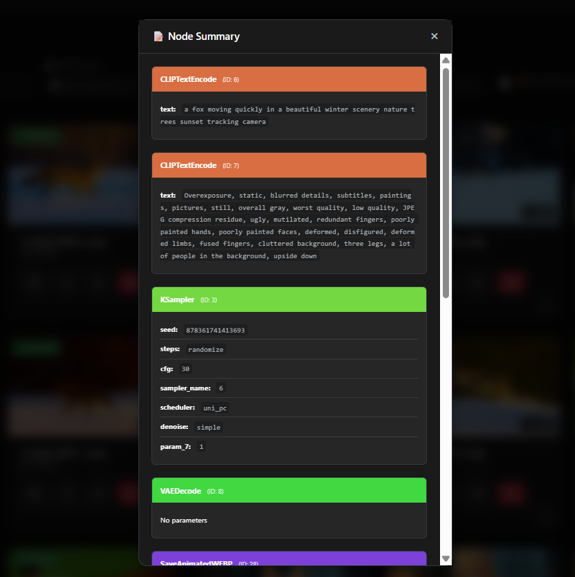
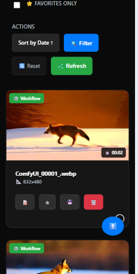

# SmartGallery for ComfyUI ✨
### Your Visual Hub with Universal Workflow Recall and Node Summary

<p align="center">
  
</p>

<p align="center">
  
</p>

<p align="center">
  <em>🎨 Beautiful, lightning-fast gallery that remembers the exact workflow behind every single creation</em>
</p>

<p align="center">
  
</p>
<p align="center">
  <em>🔍 Instant workflow insights - Node Summary</em>
</p>

<p align="center">
  <a href="LICENSE"></a>
  
  <a href="https://github.com/biagiomaf/smart-comfyui-gallery/stargazers"></a>
</p>

---

## 🚀 The Problem Every ComfyUI User Faces

You've just created the most stunning AI image or video of your life. It's perfect. Absolutely perfect.

**But wait... what workflow did you use?** 😱

Hours later, you're desperately trying to recreate that magic, clicking through endless nodes, tweaking parameters, and pulling your hair out because you can't remember the exact recipe that made it work.

**This stops now.**

---

## 🎯 What Makes SmartGallery Revolutionary

SmartGallery isn't just another image viewer. It's a **time machine for your creativity** that automatically links every single file you've ever generated to its exact workflow—whether it's PNG, JPG, MP4, or WebP.

### ⚡ Key Features That Will Transform Your Workflow

- 🏃‍♂️ **Blazing Fast**: SQLite database + smart caching = instant loading even with thousands of files
- 📱 **Mobile Perfect**: Gorgeous interface that works flawlessly on any device
- 🔍 **Node Summary Magic**: See model, seed, and key parameters at a glance
- 📁 **Total Organization**: Create, rename, delete folders; mark favorites; powerful search & filters
- 🔧 **Standalone Power**: Works independently—manage your gallery even when ComfyUI is off
- ⚡ **2-File Installation**: Just two files to transform your entire workflow

<div align="center">
  
</div>
<p align="center">
  <em>📱 Perfect mobile experience</em>
</p>

---

## 🎮 Installation: Ridiculously Simple

### Step 1: Get the Code
```bash
git clone https://github.com/biagiomaf/smart-comfyui-gallery
cd smart-comfyui-gallery
```

### Step 2: Quick Setup
```bash
# Create virtual environment (recommended)
python -m venv venv

# Activate it
# Windows: venv\Scripts\activate
# Mac/Linux: source venv/bin/activate

# Install dependencies
pip install -r requirements.txt
```

### Step 3: Configure Your Paths

Open `smartgallery.py` and find the **User Configuration** section. Just update these paths to match your setup:

```python
# 🎯 Point to your ComfyUI folders
BASE_OUTPUT_PATH = 'C:/your/path/to/ComfyUI/output'
BASE_INPUT_PATH = 'C:/your/path/to/ComfyUI/input'

# 🔧 Optional: FFmpeg path (for video workflow extraction)
FFPROBE_MANUAL_PATH = "C:/path/to/ffprobe.exe"

# 🌐 Choose your port (different from ComfyUI)
SERVER_PORT = 8189
```

> **💡 Pro Tip**: Use forward slashes (`/`) even on Windows for best compatibility!

### Step 4: Launch & Enjoy
```bash
python smartgallery.py
```

Visit **`http://127.0.0.1:8189/galleryout`** and watch the magic happen!

> **⏱️ First Run**: The initial launch takes a few minutes as SmartGallery builds your database and generates thumbnails. After that? Lightning fast!

---

## 🛠️ Advanced Configuration

Want to customize your experience? Here are the key settings you can tweak:

| Setting | Description | Default |
|---------|-------------|---------|
| `THUMBNAIL_WIDTH` | Thumbnail size in pixels | `300` |
| `PAGE_SIZE` | Files to load initially | `100` |
| `WEBP_ANIMATED_FPS` | Frame rate for WebP animations | `16.0` |
| `SPECIAL_FOLDERS` | Custom folder names in menu | `['video', 'audio']` |

**FFmpeg Recommendation**: While optional, having FFmpeg installed unlocks full video workflow extraction capabilities. Download it from [ffmpeg.org](https://ffmpeg.org/) for the complete experience.

---

## 🌐 Reverse Proxy Setup

Running behind Nginx or Apache? Point your proxy to:
```
http://127.0.0.1:8189/galleryout
```

---

## 🤝 Join the Community

### Found a Bug? Have an Idea?
**[➡️ Open an Issue](../../issues)** - I read every single one!

### Want to Contribute?
1. Fork the repo
2. Create your feature branch (`git checkout -b amazing-feature`)
3. Commit your changes (`git commit -m 'Add amazing feature'`)
4. Push to the branch (`git push origin amazing-feature`)
5. Open a Pull Request

Let's build something incredible together! 🚀

---

## 📄 License & Disclaimer

SmartGallery is released under the **MIT License** - see [LICENSE](LICENSE) for details.

This software is provided "as is" without warranty. Use responsibly and in compliance with applicable laws.

---

## ❤️ Show Some Love

If SmartGallery has transformed your ComfyUI workflow, **please give it a ⭐ star!** 

It takes 2 seconds but means the world to me and helps other creators discover this tool.

**[⭐ Star this repo now!](https://github.com/biagiomaf/smart-comfyui-gallery/stargazers)**

---

<p align="center">
  <em>Made with ❤️ for the ComfyUI community</em>
</p>